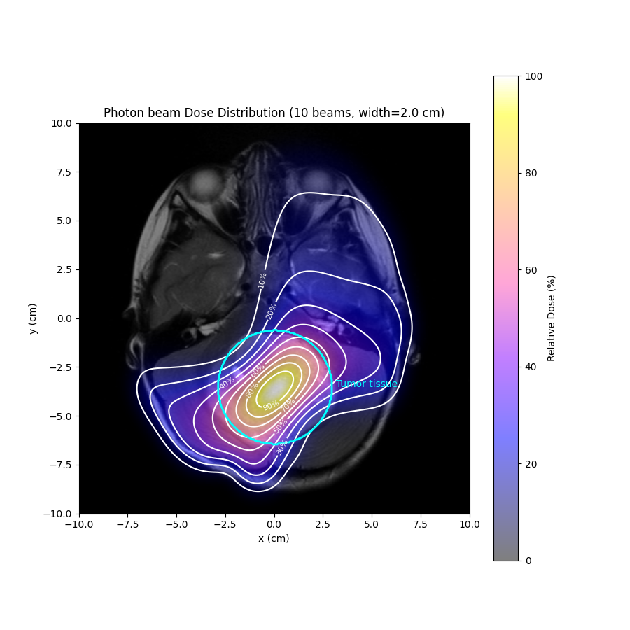
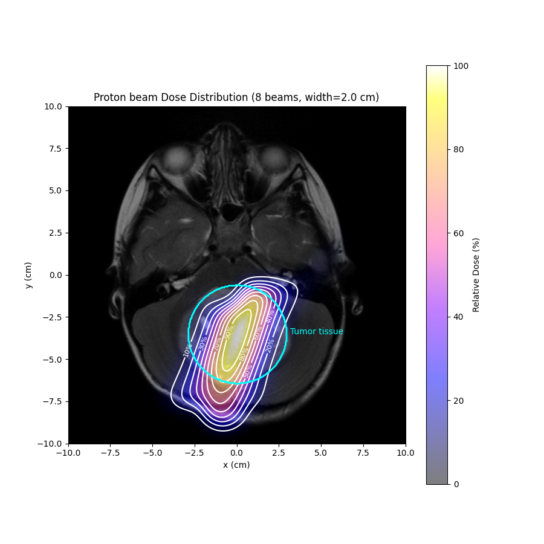

## 1.1 About:

This program calculates dose-depth values ​​for radiotherapy treatment, both for high-energy X-rays (photons) and high-energy protons (proton therapy). The program aims to demonstrate the efficiency of proton therapy in cancer treatments, as well as a method with lower radiation dosage in healthy tissues, thus reducing radiotherapy damage in patients. This study was entirely conducted as an end-of-semester presentation for Radiobiology II, administered at UFF (Brazil, RJ) in the 2025.2 semester. 

<table>
  <tr>
    <td></td>
    <td></td>
  </tr>
</table>

### 1.1.1: Considerations:

During the dose-depth percentage study, knowing the medium in which the beam is interacting is extremely important; for this reason, we consider the medium to be liquid water. This choice is accepted by numerous authors, considering that human tissue has factors compatible with a water environment. It is obvious that different tissues and body structures have different properties, but that is not the point of this study.

## 1.2 Simulation:

	  
To run the program, start a Python 3 virtual environment and install all the requirements listed in requirements.txt. The project comes with a shell script that does this for you:

```shell
chmod +x ./build.sh
./build.sh
```

To control the simulation values ​​and information, change the values ​​in data/configuration.json.

```json
{
	"Photon": {
    	"PlotEnergies": [ 
        	6,
        	18
    	],
    	"BeamWidth": 2, 
    	"PhotonEnergyPlot": 6, 
    	"Angles": [ 
        	0,
        	10,
        	20,
        	30,
        	40,
        	50,
        	60,
        	70,
        	80,
        	90
    	]
	},
	"Proton": { 
    	"And": 3, 
    	"Db": 7, 
    	"D0": 1, 
    	"BeamWidth": 2,
    	"Angles": [ 
        	0,
        	5,
        	10,
        	15,
        	20,
        	25,
        	30,
        	35
    	]
	},
	"Simulation": {
    	"ImagePath": "./assets/medulloblastoma.jpg", 
    	"MaskPath": "./assets/mask.png" 
    	"ImageAlpha": 1, 
    	"GridSize": 400 
    	"ImageSize": 20 
	}
}
```

To use an image, you must have a red mask marking where the fabric is; an example follows along with the simulation. Take a look at assets/. The demarcation doesn't need to be very precise, as it's just an approximation; you should also include the tumor area. When you start running the program, a window with your image will appear, and you should click on the center of the tumor, then click on one of its edges. This program treats the tumor as a circle. If everything goes well, the result of your simulation will appear. 

To read the full article about this simulation and the physics behind it you can access it: _https://docs.google.com/document/d/1x5jwftjvVpo8W9oqW-vHxnjcJ8dBCnEwKQQBfREUoeg/edit?usp=sharing_

## References

**Michael J. Gazda, MS , Lawrence R. Coia, MD:**  CHAPTER 2 Principles of radiation therapy (2007)  
**ONCOLOGY MEDICAL PHYSICS.** *Photon Dose Distributions*. Available at: [https://oncologymedicalphysics.com/photon-dose-distributions/](https://oncologymedicalphysics.com/photon-dose-distributions/)  
**Li X-J, Ye Y-C, Zhang Y-S, Wu J-M** (2022) Empirical modeling of the percent depth  
dose for megavoltage photon beams. PLoS ONE 17(1): e0261042. [https://doi.org/10.1371/journal.pone.0261042](https://doi.org/10.1371/journal.pone.0261042)  
**Thomas Bortfeld and Wolfgang Schlegel**(1996) An analytical approximation of depth \- dose distributions for therapeutic proton beams *Phys. Med. Biol.* **41** 1331  
**Wayne D Newhauser and Rui Zhang** (2015) The physics of proton therapy Phys. Med. Biol. 60 R155

## Contributions:

The project is very open to contributions. If you find any bugs, want to add any features, or have any questions, feel free to contact me. Topics related to the code can be opened in the Issues tab on GitHub. Other matters can be directed to my email: rick.arena314@gmail.com  
	
